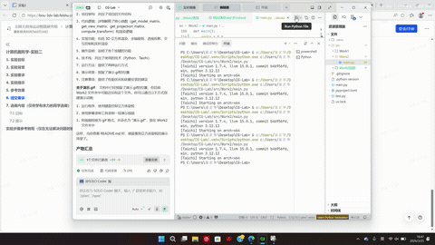

# 实验二：3D 空间坐标变换 (MVP 变换)

## 实验目标

通过本次实验，你将能够：
1. 深入理解 3D 空间中的坐标变换流程（模型-视图-投影/MVP 变换）。
2. 独立推导并用代码实现模型变换（Model）、视图变换（View）和投影变换（Projection）矩阵。
3. 掌握面向数据编程框架 Taichi 的基本语法与矩阵操作。

## 项目架构

```
work2/
├── main.py           # 主程序文件
├── 演示.gif         # 演示动画
└── README.md         # 项目说明文档
```

## 代码逻辑

### 1. 核心函数

- **get_model_matrix(angle)**：
  - 功能：接收一个旋转角度（角度制），返回绕 Z 轴旋转该角度的模型变换矩阵
  - 实现：将角度转换为弧度，计算余弦和正弦值，构建旋转矩阵

- **get_view_matrix(eye_pos)**：
  - 功能：接收相机位置（三维向量），返回视图变换矩阵
  - 实现：将相机平移至世界坐标系的原点

- **get_projection_matrix(eye_fov, aspect_ratio, zNear, zFar)**：
  - 功能：接收视场角（Y 轴方向，角度制）、屏幕长宽比、近截面距离和远截面距离，返回透视投影矩阵
  - 实现：
    1. 计算透视平截头体的边界（t, b, r, l）
    2. 构建透视到正交的挤压矩阵（M_p2o）
    3. 构建正交投影矩阵（M_ortho）
    4. 组合两个矩阵得到最终的透视投影矩阵

- **compute_transform(angle)**：
  - 功能：在并行架构上计算顶点的坐标变换
  - 实现：
    1. 计算 MVP 矩阵（proj @ view @ model）
    2. 对每个顶点进行变换
    3. 执行透视除法，将齐次坐标转换为 NDC 坐标
    4. 执行视口变换，将 NDC 坐标映射到屏幕空间

### 2. 渲染逻辑

- **main()**：
  - 初始化三角形顶点（v0: (2.0, 0.0, -2.0), v1: (0.0, 2.0, -2.0), v2: (-2.0, 0.0, -2.0)）
  - 创建 GUI 窗口（700x700）
  - 处理键盘输入（A 键和 D 键控制旋转，Esc 键退出）
  - 计算变换并绘制彩色线框三角形

## 实现功能

1. **3D 三角形渲染**：使用线框模式绘制一个三维三角形
2. **绕 Z 轴旋转**：支持绕 Z 轴的旋转
3. **透视投影**：实现了真实的透视效果，增强空间感
4. **交互控制**：通过键盘按键控制三角形的旋转
5. **实时渲染**：使用 Taichi 的并行计算能力，实现实时渲染

## 操作说明

- **A 键**：绕 Z 轴顺时针旋转
- **D 键**：绕 Z 轴逆时针旋转
- **Esc 键**：退出程序

## 技术栈

- **Python 3.10+**：基础编程语言
- **Taichi**：GPU 并行计算库，用于加速渲染
- **Taichi GUI**：用于显示和交互

## 运行方法

在项目根目录下执行以下命令：

```bash
uv run -m src.work2.main
```

或直接运行 main.py 文件：

```bash
python src\work2\main.py
```

## 演示效果



## 注意事项

- 如果运行卡顿，可以尝试将 Taichi 后端从 CPU 改为 GPU（修改 `ti.init(arch=ti.cpu)` 为 `ti.init(arch=ti.gpu)`）
- 确保安装了 Taichi 库：`uv add taichi` 或 `pip install taichi`

## 实验原理

1. **模型变换（Model）**：将物体从局部坐标系转换到世界坐标系，本实验中实现了绕 Z 轴的旋转。

2. **视图变换（View）**：将相机移动到原点，使物体相对于相机的位置正确。

3. **投影变换（Projection）**：
   - 透视到正交变换：将透视平截头体挤压为正交长方体
   - 正交投影：将正交长方体缩放和平移至标准设备坐标系（NDC）[-1, 1]^3

4. **视口变换**：将 NDC 坐标映射到屏幕空间 [0, 1] x [0, 1]。

5. **矩阵乘法顺序**：由于使用列向量，矩阵乘法遵循右乘规则：MVP = M_proj @ M_view @ M_model。