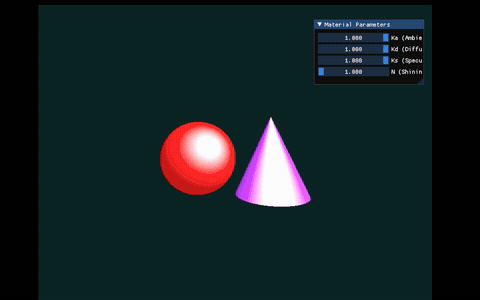

# 实验四：Phong 光照模型与光线追踪

## 实验目标

1. 理解 Phong 光照模型的基本原理，包括环境光、漫反射和镜面高光
2. 掌握光线追踪（Ray Casting）技术，实现光线与几何体的相交测试
3. 学习如何在 Taichi 中实现并行渲染
4. 了解深度测试（Z-buffer）的原理，实现正确的遮挡关系
5. 掌握如何创建交互 UI 面板，实时调整材质参数

## 项目架构

```
Work4/
├── main.py           # 主程序文件
├── BEsRrkkb_converted.gif  # 演示动画
└── README.md         # 项目说明文档
```

## 代码逻辑

### 1. 初始化与参数设置

- **窗口设置**：800x600 分辨率
- **全局参数**：
  - `Ka`：环境光系数（默认 0.2）
  - `Kd`：漫反射系数（默认 0.7）
  - `Ks`：镜面高光系数（默认 0.5）
  - `shininess`：高光指数（默认 32.0）

### 2. 辅助函数

- **normalize(v)**：向量归一化
- **reflect(I, N)**：计算光线的反射方向

### 3. 几何体相交测试

- **intersect_sphere(ro, rd, center, radius)**：
  - 功能：测试光线与球体的相交
  - 实现：求解一元二次方程，计算交点距离和法线

- **intersect_cone(ro, rd, apex, base_y, radius)**：
  - 功能：测试光线与圆锥的相交
  - 实现：转换到局部坐标系，求解一元二次方程，验证交点是否在圆锥范围内

### 4. 渲染内核

- **render()**：
  - 功能：对屏幕上的每个像素进行并行渲染
  - 实现：
    1. 生成相机光线
    2. 测试光线与球体和圆锥的相交
    3. 深度测试，选择最近的交点
    4. 计算 Phong 光照模型（环境光 + 漫反射 + 镜面高光）
    5. 输出最终颜色

### 5. 主循环与交互

- **main()**：
  - 创建 GUI 窗口
  - 初始化材质参数
  - 主循环：
    1. 执行并行渲染
    2. 绘制结果到画布
    3. 显示交互面板，允许用户调整材质参数

## 实现功能

1. **三维场景构建**：使用光线追踪技术定义红球和紫色圆锥
2. **光线求交**：实现光线与球体和圆锥的相交测试
3. **深度测试**：实现 Z-buffer 深度竞争逻辑，处理遮挡关系
4. **Phong 光照模型**：实现环境光、漫反射和镜面高光的计算
5. **实时交互**：提供 UI 面板，允许用户调整材质参数
6. **GPU 加速**：使用 Taichi 的并行计算能力，实现高效渲染

## 操作说明

- **交互面板**：
  - `Ka (Ambient)`：调整环境光系数（0.0-1.0）
  - `Kd (Diffuse)`：调整漫反射系数（0.0-1.0）
  - `Ks (Specular)`：调整镜面高光系数（0.0-1.0）
  - `N (Shininess)`：调整高光指数（1.0-128.0）
- **关闭窗口**：退出程序

## 技术栈

- **Python 3.10+**：基础编程语言
- **Taichi**：GPU 并行计算库，用于加速渲染
- **Taichi UI**：用于创建交互窗口和控制面板

## 运行方法

在项目根目录下执行以下命令：

```bash
uv run -m src.Work4.main
```

或直接运行 main.py 文件：

```bash
python src\Work4\main.py
```

## 演示效果



## 注意事项

- **后端选择**：如果 GPU 初始化失败，可以将 `ti.init(arch=ti.gpu)` 改为 `ti.init(arch=ti.cpu)`
- **性能优化**：使用 Taichi 的并行计算能力，渲染速度会比 CPU 版本快很多
- **参数调整**：通过 UI 面板调整材质参数，可以观察到不同光照效果

## 实验原理

### 1. Phong 光照模型

Phong 光照模型将物体表面反射的光分为三个独立的计算分量：

- **环境光 (Ambient)**：模拟场景中经过多次反射后均匀分布的背景光
  ```
  I_ambient = K_a × C_light × C_object
  ```

- **漫反射 (Diffuse)**：模拟粗糙表面向各个方向均匀散射的光，强度与光线入射角的余弦值成正比（Lambert 定律）
  ```
  I_diffuse = K_d × max(0, N·L) × C_light × C_object
  ```

- **镜面高光 (Specular)**：模拟光滑表面反射的强光，强度与观察方向和理想反射方向的夹角有关
  ```
  I_specular = K_s × max(0, R·V)^n × C_light
  ```

### 2. 光线追踪技术

- **光线生成**：从相机出发，为每个像素生成一条光线
- **光线求交**：计算光线与场景中几何体的交点
- **深度测试**：选择距离相机最近的交点，处理遮挡关系
- **着色计算**：在交点处计算 Phong 光照模型，得到像素颜色

### 3. 几何体定义

- **红球**：放置在屏幕左侧，圆心坐标 (-1.2, -0.2, 0)，半径 1.2，基础颜色 (0.8, 0.1, 0.1)
- **紫色圆锥**：放置在屏幕右侧，顶点坐标 (1.2, 1.2, 0)，底面高度 y = -1.4，底面半径 1.2，基础颜色 (0.6, 0.2, 0.8)

### 4. 相机与光源

- **相机**：固定在 (0, 0, 5)
- **点光源**：固定在 (2, 3, 4)，颜色为纯白 (1.0, 1.0, 1.0)
- **背景色**：深青色 (0.05, 0.15, 0.15)
