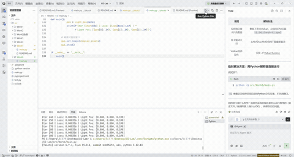

# 实验六：可微渲染
202411998380 宋正华 计算机科学与技术

## 实验目标

1. 理解可微渲染（Differentiable Rendering）的核心思想与应用场景
2. 掌握基础正向光线投射管线（Ray Casting Pipeline）的构建
3. 利用 Taichi 的自动微分（AutoDiff）机制，通过梯度下降法反向优化三维场景参数（如光源位置）
4. 深入理解优化过程中的梯度消失问题，并学习在光照模型中引入特定的平滑/泄漏机制以保证梯度的连续传导

## 项目架构

```
Work6/
├── main.py           # 主程序文件
├── 演示.gif          # 演示动画
└── README.md         # 项目说明文档
```

## 代码逻辑

### 1. 初始化与参数设置

- **渲染分辨率**：256x256
- **目标光源位置**：`TARGET_LIGHT = [0.8, 0.8, 0.2]`
- **初始光源位置**：`[0.2, 0.2, 0.8]`（位于球体背面，偏离目标）
- **场景参数**：
  - 球体中心：`(0.5, 0.5, 0.5)`
  - 球体半径：`0.3`

### 2. 生成目标图像

- **generate_target()**：使用目标光源位置生成 Ground Truth 图像
  - 遍历每个像素，计算光线与球体的交点
  - 使用标准 Lambertian 漫反射模型计算光照强度

### 3. 可微渲染与损失计算

- **render_and_compute_loss()**：
  - 执行正向渲染，使用当前光源位置计算每个像素的光照强度
  - 采用 **Leaky Lambertian（泄漏漫反射）** 模型：`intensity = ti.max(0.1 * dot_val, dot_val)`
  - 计算当前渲染图像与目标图像的 **MSE Loss**
  - 左半侧显示目标图像，右半侧显示当前渲染结果

### 4. 优化器实现

- **Adam 优化器**：
  - 使用 `ti.ad.Tape(loss=loss)` 记录计算图并自动求导
  - 维护一阶动量 `m` 和二阶动量 `v`
  - 应用偏差修正（Bias Correction）
  - 学习率 `lr = 0.02`

### 5. 主循环

- **main()**：
  - 初始化场景，生成目标图像
  - 设置初始光源位置和优化器参数
  - 迭代优化 300 次：
    - 正向渲染并计算 Loss
    - 反向传播计算梯度
    - 使用 Adam 更新光源位置
    - 每 10 轮输出 Loss 和光源坐标
    - 更新可视化窗口

## 实现功能

1. **正向光线投射**：
   - 为每个像素生成射线，计算与球体的交点
   - 使用 Lambertian 漫反射模型计算光照

2. **可微渲染管线**：
   - 将光源位置声明为支持求导的 Taichi Field（`needs_grad=True`）
   - 使用 `ti.ad.Tape()` 自动计算梯度
   - 损失函数为均方误差（MSE）

3. **Leaky Lambertian 模型**：
   - 引入泄漏系数 0.1，保证阴影区域也能产生非零梯度
   - 防止梯度消失，使光源能够"跨越黑暗"移动到正面

4. **Adam 优化器**：
   - 引入动量机制，加速收敛
   - 自适应学习率，参数更新轨迹更平滑

5. **可视化对比**：
   - 左侧：固定不变的目标图像（Ground Truth）
   - 右侧：动态更新的当前渲染结果
   - 可观察高光斑从错误位置平滑移动并最终重合

## 操作说明

- **程序启动**：直接运行 `main.py`，程序会自动开始优化过程
- **终端输出**：每 10 轮迭代输出当前 Loss 和光源坐标
- **关闭窗口**：退出程序

## 技术栈

- **Python 3.10+**：基础编程语言
- **Taichi**：GPU 并行计算库，支持自动微分
- **Taichi UI**：用于创建可视化窗口

## 运行方法

在项目根目录下执行以下命令：

```bash
python src\Work6\main.py
```

## 演示效果



## 注意事项

- **后端选择**：已使用 CPU 后端 `ti.init(arch=ti.cpu)`，兼容性更好
- **梯度泄漏**：Leaky Lambertian 的泄漏系数 0.1 是保证优化成功的关键，不可随意修改
- **Loss 计算**：计算 Loss 时必须保留光照强度的负值部分，不可提前截断为 0
- **收敛速度**：初始光源位于背面时，Loss 下降较慢；光源绕到正面后，Loss 会断崖式下降

## 实验原理

### 1. 可微渲染核心思想

构建"渲染图像 → 计算误差 → 误差反传 → 更新参数"的完整闭环：

```
目标图像 (Ground Truth)
       │
       ▼
当前渲染图像 (Rendered)
       │
       ▼
计算 MSE Loss
       │
       ▼
反向传播 (AutoDiff)
       │
       ▼
更新光源位置 (Adam)
       │
       ▼ (循环)
```

### 2. 梯度消失问题

标准 Lambertian 漫反射模型公式为 `I = max(0, n·l)`。在可微渲染中，直接使用该模型存在隐患：

- 当顶点处于阴影中（即 `n·l ≤ 0`）时，光照强度被截断为 0
- 导致梯度严格为 0，优化将陷入停滞
- 如果初始光源完全在球体背面，优化无法进行

### 3. Leaky Lambertian（泄漏漫反射）

为解决梯度消失问题，采用泄漏机制：

```
I = max(α(n·l), n·l)
```

其中 `α` 为一个小常数（如 0.1）。这样即使光源处于暗处，也能获得指向正确方向的梯度，引导光源"跨越黑暗"来到正面。

### 4. 损失函数

采用均方误差（MSE）衡量当前渲染图像与目标图像之间的差异：

```
L = (1/N) * Σ(I_rendered - I_target)²
```

### 5. Adam 优化器

Adam（Adaptive Moment Estimation）结合了动量（Momentum）和 RMSprop 的优点：

```
m_t = β₁ * m_{t-1} + (1 - β₁) * g_t
v_t = β₂ * v_{t-1} + (1 - β₂) * g_t²

m̂_t = m_t / (1 - β₁^t)
v̂_t = v_t / (1 - β₂^t)

θ_t = θ_{t-1} - lr * m̂_t / (√(v̂_t) + ε)
```

- `β₁ = 0.9`：一阶动量衰减系数
- `β₂ = 0.999`：二阶动量衰减系数
- `lr = 0.02`：学习率
- `ε = 1e-8`：防止除零

### 6. 预期优化过程

1. **初始阶段**：光源位于球体背面，Loss 较大，下降缓慢
2. **过渡阶段**：光源逐渐向正面移动，Loss 开始下降
3. **快速收敛阶段**：光源绕到正面后，Loss 断崖式下降
4. **微调阶段**：由于 Adam 的动量特性，可能出现轻微超调（Overshoot），随后快速收敛并稳定在目标位置 `(0.8, 0.8, 0.2)`