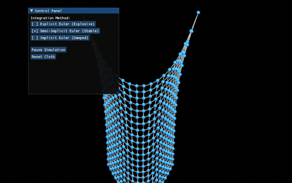

# 实验七：质点弹簧系统

## 实验目标

1. 理解质点弹簧系统（Mass Spring System）的物理原理与数学模型
2. 掌握三种数值积分方法：显式欧拉、半隐式欧拉、隐式欧拉
3. 理解不同积分方法的稳定性差异及适用场景
4. 学习使用 Taichi GGUI 进行三维物理模拟的可视化
5. 掌握布料模拟中弹簧网络的构建方法

## 项目架构

```
Work7/
├── main.py           # 主程序文件
├── 演示.gif          # 演示动画
└── README.md         # 项目说明文档
```

## 代码逻辑

### 1. 初始化与参数设置

- **网格分辨率**：N = 20（20x20 的质点网格）
- **物理参数**：
  - `mass = 1.0`：质点质量
  - `dt = 5e-4`：时间步长
  - `k_s = 10000.0`：弹簧劲度系数
  - `k_d = 1.0`：阻尼系数
  - `gravity = [0.0, -9.8, 0.0]`：重力加速度
  - `max_velocity = 50.0`：速度上限，防止数值爆炸

### 2. 初始化函数

- **init_positions()**：初始化质点位置与固定状态
  - 将布料放置在三维空间的 XY 平面上
  - 固定第一排的两个角点（左上角和右上角）
- **init_springs()**：初始化结构弹簧
  - 右侧相邻点（水平方向）
  - 下方相邻点（垂直方向）
- **init_spring_indices()**：同步渲染索引，用于绘制弹簧线框

### 3. 力计算

- **compute_forces_on()**：
  - 清空受力，施加重力与阻尼
  - 累加弹簧力（使用 atomic_add 保证多线程安全）
  - 弹簧力公式：`F = -k_s * (dist - rest_length) * normalized_dir`

### 4. 三种积分方法

- **step_explicit()**：显式欧拉（Explicit Euler）
  - 先更新位置，再更新速度
  - 极易发散，需要极小的时间步长

- **step_semi_implicit()**：半隐式欧拉（Semi-Implicit Euler）
  - 先更新速度，再用新速度更新位置
  - 相对稳定，是游戏物理引擎中最常用的方法

- **step_implicit_iter()**：隐式欧拉（Implicit Euler）
  - 使用定点迭代法近似求解未来状态
  - 数值阻尼大，最为稳定但会有能量耗散

### 5. 主循环与交互

- **main()**：
  - 创建 GGUI 窗口（800x800）
  - 设置相机位置与视角
  - 主循环：处理 GUI 交互、物理更新、渲染场景
  - 每帧进行 40 次子步更新（40 × 5e-4 = 0.02s/帧 ≈ 实时速度）

## 实现功能

1. **三维布料模拟**：使用 20x20 的质点网格模拟布料
2. **结构弹簧网络**：构建水平和垂直方向的弹簧连接
3. **三种积分方法对比**：
   - 显式欧拉（不稳定，易爆炸）
   - 半隐式欧拉（相对稳定）
   - 隐式欧拉（最稳定，有数值阻尼）
4. **交互控制面板**：
   - 切换积分方法（切换时自动重置布料）
   - 暂停/恢复模拟
   - 重置布料到初始状态
5. **相机交互**：支持鼠标拖拽旋转视角（按住右键）
6. **三维渲染**：绘制质点粒子和弹簧线框

## 操作说明

- **交互面板**：
  - `Explicit Euler (Explosive)`：显式欧拉积分（极不稳定）
  - `Semi-Implicit Euler (Stable)`：半隐式欧拉积分（推荐）
  - `Implicit Euler (Damped)`：隐式欧拉积分（最稳定）
  - `Pause Simulation` / `Resume Simulation`：暂停/恢复模拟
  - `Reset Cloth`：重置布料到初始状态
- **视角控制**：按住鼠标右键拖拽旋转视角
- **关闭窗口**：退出程序

## 技术栈

- **Python 3.10+**：基础编程语言
- **Taichi**：GPU 并行计算库，用于加速物理模拟
- **Taichi GGUI**：用于创建三维可视化窗口和交互面板

## 运行方法

在项目根目录下执行以下命令：

```bash
python src\Work7\main.py
```

## 演示效果



## 注意事项

- **后端选择**：默认使用 GPU 后端 `ti.init(arch=ti.gpu)`，如果 GPU 初始化失败可改为 CPU
- **显式欧拉**：该方法极不稳定，即使使用当前较小的时间步长也会迅速发散
- **半隐式欧拉**：最推荐使用的方法，兼顾稳定性和计算效率
- **隐式欧拉**：虽然最稳定，但存在明显的数值阻尼，布料运动会逐渐衰减
- **速度钳制**：设置了 `max_velocity = 50.0` 以防止数值爆炸
- **切换方法**：切换积分方法时会自动重置布料状态，防止从不稳定状态继续

## 实验原理

### 1. 质点弹簧系统

将布料离散化为质点网格，质点之间通过弹簧连接。每个质点受到以下力的作用：

- **重力**：`F_gravity = m * g`
- **阻尼力**：`F_damping = -k_d * v`
- **弹簧力**（胡克定律）：`F_spring = -k_s * (|x_i - x_j| - L_0) * (x_i - x_j) / |x_i - x_j|`

### 2. 显式欧拉（Explicit Euler）

```
v_{n+1} = v_n + (F_n / m) * dt
x_{n+1} = x_n + v_n * dt
```

- 使用当前时刻的力和速度计算下一时刻状态
- 条件稳定，时间步长必须小于临界值（约 `dt < 2 * sqrt(m/k_s)`）
- 在实际布料模拟中极易发散

### 3. 半隐式欧拉（Semi-Implicit Euler）

```
v_{n+1} = v_n + (F_n / m) * dt
x_{n+1} = x_n + v_{n+1} * dt
```

- 先更新速度，再用新速度更新位置
- 无条件稳定（对于弹簧系统）
- 能量会有轻微增长，但通常可接受
- 游戏物理引擎（如 Box2D、Bullet）的默认选择

### 4. 隐式欧拉（Implicit Euler）

```
v_{n+1} = v_n + (F_{n+1} / m) * dt
x_{n+1} = x_n + v_{n+1} * dt
```

- 使用未来时刻的力计算未来状态
- 需要求解非线性方程组
- 本实现使用定点迭代法近似求解
- 无条件稳定，但引入数值阻尼

### 5. 弹簧网络结构

- **结构弹簧**（Structural Springs）：连接相邻质点（水平和垂直方向）
- 本实验仅实现了结构弹簧，实际布料模拟还可加入：
  - 剪切弹簧（Shear Springs）：连接对角线方向的质点
  - 弯曲弹簧（Bend Springs）：连接间隔一个质点的位置
